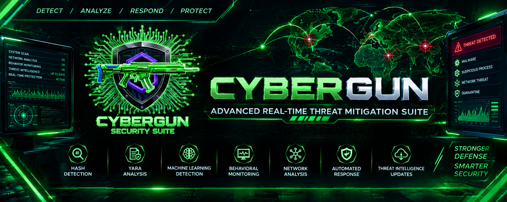

# CyberGun: Advanced Real-Time Threat Mitigation Suite

<p align="center">
  
</p>

<p align="center">
  <strong>Advanced Real-Time Threat Detection, Analysis & Mitigation</strong>
</p>

<p align="center">
  
  
  
  
  
</p>

<p align="center">
  A multi-layered defensive cybersecurity platform combining static analysis,
  machine learning, behavioral monitoring, network analysis,
  threat intelligence, and automated response.
</p>

---

## Overview

CyberGun is a high-performance, intelligent threat detection and mitigation suite designed for proactive cybersecurity defense.

It moves beyond traditional signature-based scanning by combining multiple security layers into a unified platform.

CyberGun integrates:

- Static malware analysis
- Hash-based threat detection
- YARA rule analysis
- Byte-signature detection
- Machine-learning-based detection
- Dynamic behavioral monitoring
- Real-time filesystem monitoring
- Network traffic analysis
- IP threat intelligence
- Automated threat response
- Process termination
- File quarantine
- Live threat intelligence updates

The system is designed primarily for Windows-based defensive security monitoring and analysis.

---

# Core Capabilities

```text
                         CYBERGUN
                            │
          ┌─────────────────┼─────────────────┐
          │                 │                 │
       STATIC            DYNAMIC           NETWORK
       ANALYSIS          ANALYSIS          ANALYSIS
          │                 │                 │
     ┌────┼────┐       ┌────┼────┐       ┌────┼────┐
     │    │    │       │    │    │       │    │    │
    HASH YARA  ML    BEHAVIOR FILE   TRAFFIC   IP   FIREWALL
     │    │    │       │    │    │       │    │    │
     └────┼────┘       └────┼────┘       └────┼────┘
          │                 │                 │
          └─────────────────┼─────────────────┘
                            │
                    THREAT CORRELATION
                            │
                            ▼
                    THREAT ASSESSMENT
                            │
             ┌──────────────┼──────────────┐
             │              │              │
             ▼              ▼              ▼
         LOGGING       QUARANTINE     RESPONSE
                            │
                            ▼
                     THREAT MITIGATION


```
---

# Features

## 1. Multi-Layered Static Scanning

CyberGun provides multiple static analysis mechanisms for identifying suspicious and malicious files.

### Hash Detection

Known malware can be identified through hash matching against threat intelligence databases.

Supported hash intelligence includes:

- SHA256
- SHA1
- MD5
- MalwareBazaar threat hashes

### YARA Engine

CyberGun integrates YARA-based detection for identifying:

- Malware families
- Suspicious files
- Threat actor patterns
- Known malicious artifacts
- Malware signatures

The system supports integration with the industry-standard:

signature-base

### Byte Signatures

Custom byte-signature detection provides an additional layer for identifying known malicious binary patterns.

### String Detection

Suspicious strings and indicators can be analyzed as part of the static detection pipeline.

### Machine Learning Detection

CyberGun includes LightGBM-based machine-learning models for classification of different file types.

Supported model categories include:

- Windows PE
- Windows 32-bit
- Windows 64-bit
- ELF
- PDF
- APK
- .NET

Machine learning provides an additional detection layer beyond traditional signatures and hash matching.

---

# 2. Dynamic Real-Time Monitoring

CyberGun includes a dynamic monitoring subsystem designed to observe system activity in real time.

## Behavioral Analysis

The behavioral monitoring engine analyzes system activity and looks for suspicious patterns.

It can monitor activities associated with:

- Processes
- System behavior
- File activity
- Suspicious execution
- Ransomware-like behavior

## Live Event Feed

The graphical dashboard provides real-time visibility into security events.

Examples include:

- New process creation
- System events
- USB device activity
- Suspicious behavior
- Security alerts

## Real-Time File Guard

CyberGun monitors filesystem activity for newly created or modified files.

When relevant file activity is detected, the system can initiate further security analysis.

---

# 3. Professional Network Security Dashboard

CyberGun contains a dedicated network security subsystem.

## Live Network Traffic

The network dashboard provides real-time visibility into:

- Upload traffic
- Download traffic
- Network activity
- Active connections

## Network Threat Analysis

Network connections can be correlated with threat intelligence.

CyberGun supports IP-based threat intelligence such as:

- FireHOL Level 1
- Live IP blacklist data

## Connection Analysis

The network subsystem can analyze active connections and associate network activity with local processes where supported.

## Packet Analysis

CyberGun includes support for TShark-based packet analysis.

For live packet capture, the appropriate network capture components must be installed and configured on the host system.

---

# 4. Automated Threat Response

CyberGun provides defensive response capabilities when threats are identified.

## Process Termination

For high-severity threats, CyberGun can identify the associated process and terminate it where permitted by the operating system.

## File Quarantine

Suspicious or malicious files can be moved to an isolated quarantine location.

This helps prevent accidental execution or further access to the identified file.

## Threat Logging

Security events and confirmed threats are recorded for later investigation and review.

---

# 5. Live Threat Intelligence

CyberGun supports automatic and manual threat intelligence updates.

Threat intelligence sources include:

### Malware Hash Intelligence

Abuse.ch MalwareBazaar

Used for malware hash information.

### IP Threat Intelligence

FireHOL

Used for IP blacklist information.

### YARA Intelligence

signature-base

Used for YARA detection rules.

Threat intelligence can be updated during application startup or manually through the application dashboard.

---

# Architecture

CyberGun follows a modular, decoupled architecture built around PyQt5 and signal-driven communication.

```text
CyberGun/
│
├── main.py
│
├── core/
│   ├── DynamicEngine.py
│   ├── FileSystemMonitor.py
│   ├── ForensicAnalyzer.py
│   ├── NetworkEngine.py
│   ├── QuarantineManager.py
│   ├── SignalBus.py
│   ├── StaticEngine.py
│   ├── ThreatDownloader.py
│   ├── ThreatResponder.py
│   ├── config_manager.py
│   ├── database_manager.py
│   └── engine_launcher.py
│
├── static_scanners/
│   ├── HashDetector.py
│   ├── MLDetector.py
│   ├── SignDetector.py
│   ├── StringDetector.py
│   └── YaraDetector.py
│
├── dynamic_scanners/
│   ├── ApiTraceManager.py
│   ├── BehaviorMonitor.py
│   ├── RansomwareMonitor.py
│   ├── SandboxSim.py
│   ├── SystemMonitor.py
│   └── USBMonitor.py
│
├── network_scanners/
│   ├── ConnectionProcessMapper.py
│   ├── FirewallManager.py
│   ├── LiveNetworkThreatFetcher.py
│   ├── NetworkAnalyzer.py
│   └── TSharkSniffer.py
│
├── gui/
│   ├── components/
│   ├── gui_app.py
│   └── theme.py
│
├── datasets/
│   ├── hashes/
│   ├── yara_rules/
│   ├── network/
│   ├── signatures/
│   ├── strings/
│   └── icons/
│
├── models/
│   └── static_models/
│
├── EMBER2024/
│
├── utils/
│   ├── logger.py
│   ├── report_generator.py
│   └── system_checks.py
│
└── requirements.txt


```
---

# Security Detection Pipeline

A simplified CyberGun detection workflow:

```text
                 SECURITY EVENT
                       │
          ┌────────────┼────────────┐
          │            │            │
         FILE        PROCESS      NETWORK
          │            │            │
          ▼            ▼            ▼
       STATIC       DYNAMIC      NETWORK
       ENGINE       ENGINE        ENGINE
          │            │            │
          └────────────┼────────────┘
                       │
                       ▼
                THREAT ANALYSIS
                       │
          ┌────────────┼────────────┐
          │            │            │
        HASH          YARA          ML
          │            │            │
          └────────────┼────────────┘
                       │
                       ▼
                THREAT CORRELATION
                       │
                       ▼
                 SEVERITY LEVEL
                       │
             ┌─────────┴─────────┐
             │                   │
           SAFE              THREAT
             │                   │
             ▼                   ▼
           LOG              RESPONSE
                                 │
                    ┌────────────┼────────────┐
                    │            │            │
                    ▼            ▼            ▼
                QUARANTINE   TERMINATION   ALERT


```
---

# Machine Learning

CyberGun incorporates machine-learning components for security classification.

The project includes LightGBM-based static detection models.

Model categories include:

```text
models/
└── static_models/
    ├── apk_model.lgbm
    ├── dotnet_model.lgbm
    ├── elf_model.lgbm
    ├── pdf_model.lgbm
    ├── win32_model.lgbm
    └── win64_model.lgbm


The project also contains EMBER-related machine-learning components under:

text
EMBER2024/


```
---

# Behavioral ML Feature Set

The behavioral ML subsystem is designed around memory-forensics-derived information.

The feature set includes information associated with Volatility plugins such as:

- `pslist`
- `dlllist`
- `handles`
- `ldrmodules`
- `malfind`
- `psxview`
- `modules`
- `svcscan`
- `callbacks`

The project architecture supports a 55-feature behavioral analysis model.

---

# Technology Stack

| Category | Technologies |
|---|---|
| Programming Language | Python 3.9+ |
| GUI Framework | PyQt5 |
| Graphing | PyQtGraph |
| Machine Learning | LightGBM |
| ML Utilities | Scikit-learn, Joblib |
| Static Analysis | YARA-Python |
| Signature Detection | Custom byte signatures |
| Network Analysis | Scapy |
| Packet Analysis | TShark |
| System Monitoring | psutil |
| Windows Integration | pywin32 |
| Threat Intelligence | Abuse.ch MalwareBazaar |
| IP Intelligence | FireHOL |
| YARA Rules | signature-base |
| Operating System | Windows |

---

# Prerequisites

Before installing CyberGun, make sure the following components are available.

| Requirement | Details |
|---|---|
| Python | 3.9+ recommended |
| Git | Required for repository and YARA ruleset operations |
| Windows | Primary target platform |
| Npcap | Required for Scapy-based live network sniffing |
| Wireshark / TShark | Required for TShark-based packet analysis |

---

# Npcap Installation

CyberGun's network monitoring capabilities can use Scapy for live network traffic analysis.

Install Npcap from:

https://npcap.com

During installation, enable:

WinPcap API-compatible Mode

---

# Wireshark / TShark

TShark is used for packet-level network analysis.

Install Wireshark on the Windows system and ensure that the TShark executable is available through the system PATH or configured through CyberGun's settings.

A typical TShark installation path may be:

```text
C:\Program Files\Wireshark\tshark.exe


The exact path depends on the local installation.

```
---

# Installation

## 1. Clone the Repository

```bash
git clone https://github.com/hckr-zahid/CyberGun.git
cd CyberGun


```
---

## 2. Create a Virtual Environment

### Windows

```powershell
python -m venv venv


Activate it:

powershell
venv\Scripts\activate


### Linux / macOS

bash
python3 -m venv venv
source venv/bin/activate


```
---

## 3. Install Dependencies

```bash
pip install -r requirements.txt


```
---

# YARA Rules Installation

CyberGun's YARA detection engine requires an appropriate YARA ruleset.

The project supports integration with:

signature-base

Clone the ruleset into the CyberGun YARA rules directory:

```bash
cd datasets/yara_rules

git clone https://github.com/Neo23x0/signature-base.git signature-base-master

cd ../..


After installation, verify that the rules are available under:

text
datasets/yara_rules/


```
---

# Threat Intelligence Databases

CyberGun can automatically download threat intelligence datasets during startup.

These include:

```text
Abuse.ch MalwareBazaar
        │
        ▼
 Malware Hashes
        │
        ▼
 CyberGun Hash Detection


FireHOL
        │
        ▼
 IP Blacklists
        │
        ▼
 Network Threat Analysis


signature-base
        │
        ▼
 YARA Rules
        │
        ▼
 YARA Detection


Threat intelligence can also be updated manually from the CyberGun dashboard.

```
---

# Running CyberGun

Start CyberGun with:

```bash
python main.py


The application initializes its security components and launches the CyberGun interface.

The startup process may include:

1. Application initialization
2. Security engine initialization
3. Threat intelligence initialization
4. Database synchronization
5. Static engine startup
6. Dynamic monitoring initialization
7. Network monitoring initialization
8. Main dashboard launch

```
---

# Main Security Engines

## Static Engine

The Static Engine manages file-based security scanners.

```text
StaticEngine
│
├── HashDetector
├── YaraDetector
├── SignDetector
├── StringDetector
└── MLDetector


```
---

## Dynamic Engine

The Dynamic Engine manages real-time system monitoring.

```text
DynamicEngine
│
├── BehaviorMonitor
├── SystemMonitor
├── USBMonitor
├── RansomwareMonitor
├── SandboxSim
└── ApiTraceManager


```
---

## Network Engine

The Network Engine manages network security analysis.

```text
NetworkEngine
│
├── NetworkAnalyzer
├── LiveNetworkThreatFetcher
├── ConnectionProcessMapper
├── FirewallManager
└── TSharkSniffer


```
---

# Threat Response Workflow

When CyberGun identifies a potentially malicious event, the system can follow a defensive response workflow:

```text
Detection
    │
    ▼
Threat Analysis
    │
    ▼
Severity Assessment
    │
    ├───────────────┐
    │               │
    ▼               ▼
Low / Safe       High Risk
    │               │
    ▼               ▼
Logging       Threat Response
                    │
             ┌──────┴──────┐
             │             │
             ▼             ▼
        Quarantine    Process Response
             │             │
             └──────┬──────┘
                    ▼
              Security Log


```
---

# Project Directory Reference

| Directory | Purpose |
|---|---|
| `core/` | Core application and engine orchestration |
| `static_scanners/` | Static malware detection |
| `dynamic_scanners/` | Dynamic system monitoring |
| `network_scanners/` | Network security analysis |
| `gui/` | PyQt5 graphical interface |
| `datasets/` | Threat intelligence and detection datasets |
| `datasets/hashes/` | Malware hash databases |
| `datasets/yara_rules/` | YARA rules |
| `datasets/network/` | Network threat intelligence |
| `datasets/signatures/` | Signature databases |
| `datasets/icons/` | CyberGun graphical assets |
| `models/` | Machine-learning models |
| `EMBER2024/` | EMBER-based ML components |
| `utils/` | Utility and support components |
| `config/` | Configuration files |

---

# Dashboard

The CyberGun dashboard is designed to provide centralized visibility into the security state of the system.

The interface brings together:

- System status
- Threat events
- Network activity
- Behavioral monitoring
- File analysis
- Threat intelligence
- Quarantine information
- Security logs
- Detection results

---

# Threat Intelligence Sources

CyberGun integrates multiple external security intelligence sources.

| Source | Purpose |
|---|---|
| Abuse.ch MalwareBazaar | Malware hash intelligence |
| FireHOL | IP blacklist intelligence |
| signature-base | YARA detection rules |

These sources are used to enhance CyberGun's detection and correlation capabilities.

---

# Defensive Security Philosophy

CyberGun follows a layered defensive approach:

```text
                 PREVENT
                    │
                    ▼
                DETECT
                    │
                    ▼
                ANALYZE
                    │
                    ▼
                CORRELATE
                    │
                    ▼
                RESPOND
                    │
                    ▼
               QUARANTINE
                    │
                    ▼
                 LOG
                    │
                    ▼
                REVIEW


Rather than depending on a single detection mechanism, CyberGun combines multiple security techniques to improve visibility and defensive response.

```
---

# Development

CyberGun is structured as a modular Python security application.

New detection capabilities can be integrated through the existing engine architecture.

Potential extension areas include:

- Additional YARA rules
- Additional machine-learning models
- New static scanners
- Additional behavioral monitors
- Network detection modules
- Additional threat intelligence feeds
- Advanced forensic analysis
- Security reporting
- Additional automated response mechanisms

---

# Author

## Zahid Ullah

Cybersecurity Analyst | SOC & Threat Detection | DFIR | CEH | CHFI | (ISC)² CC

### GitHub

https://github.com/hckr-zahid

### LinkedIn

https://linkedin.com/in/hckr-zahid

### Email

hckr.badguy@gmail.com

---

# License

This project is licensed under the MIT License.

See the [LICENSE](LICENSE) file for details.

---

# Disclaimer

> ⚠️ CyberGun is developed for educational and defensive cybersecurity purposes only.
>
> The author is not responsible for misuse, unauthorized deployment, or any activity conducted outside authorized security testing, research, or defensive environments.


<p align="center">
  <strong>CYBERGUN</strong>
  <br>
  Advanced Real-Time Threat Mitigation Suite
  <br><br>
  <em>Stronger Defense • Smarter Security</em>
</p>
